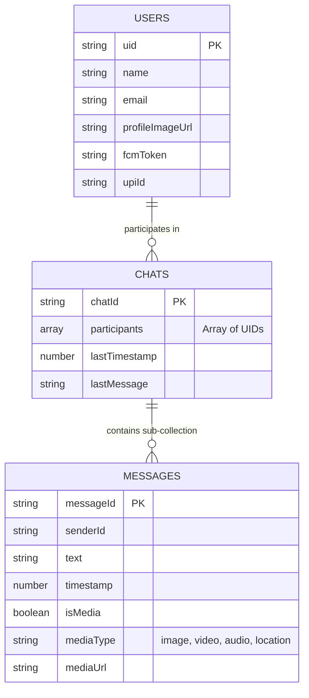

# Chat Schema & Data Architecture

RippleChat is structured using a normalized NoSQL database design on Firebase Firestore. To optimize for read speeds, minimize costs, and securely scope data, we utilize a combination of top-level collections and sub-collections.

## Architecture & End-to-End Flow

## Logic Explained

### 1. Sub-collection Schema vs Flat Schema
Originally, applications often use a flat `messages` collection. However, RippleChat uses a `chats` collection where each document represents a unique conversation between two users. Inside each `chats` document is a `messages` sub-collection.
* **Why?** It restricts data queries. We only load messages for the currently opened chat.
* **Chat ID generation:** `chatId` is deterministically generated by sorting and combining user UIDs: `uidA-uidB`.

### 2. Dashboard Chat List
The `DashboardScreen` displays recent chats. To do this without querying all messages in the world, the `chats` document holds metadata: `lastMessage` and `lastTimestamp`. When a new message is sent, the ViewModel updates both the sub-collection (inserting the message) and the parent document (updating the preview).

### 3. Real-time Listeners
We use `addSnapshotListener` on both the dashboard and the chat screen. This maintains a persistent WebSocket connection to Firestore. When a document changes on the server, the client is instantly updated via Kotlin `StateFlow` streams, triggering automatic UI recomposition in Jetpack Compose.
