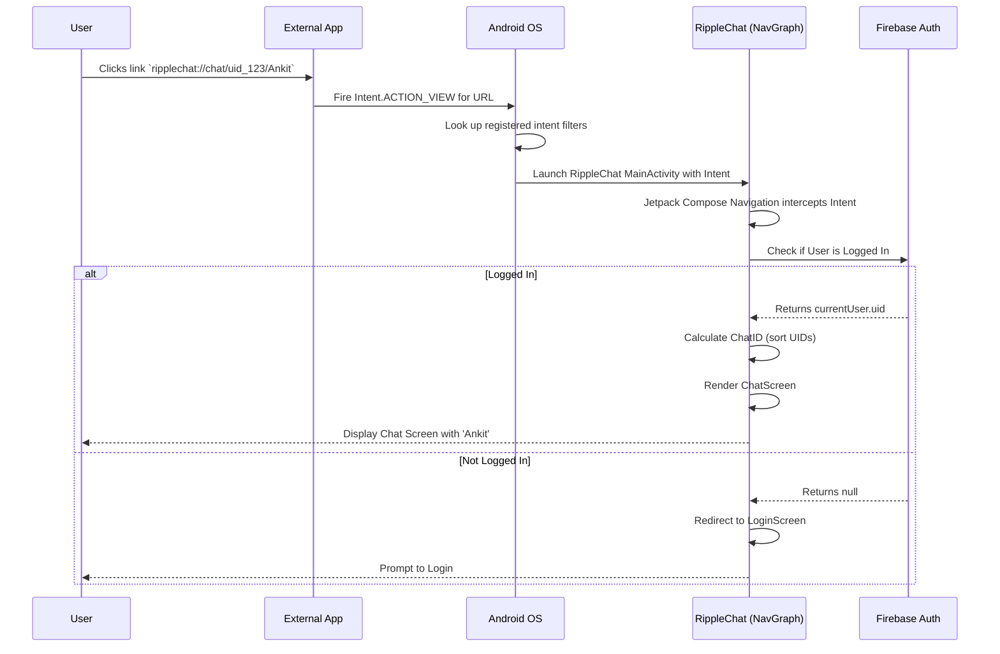

# Deep Linking Implementation

This document outlines how RippleChat handles Deep Links (specifically URI Schema routing) to allow external applications (like WhatsApp or a web browser) to open RippleChat directly to a specific screen, such as a Chat Screen.

## Architecture & End-to-End Flow



## Logic Explained

### 1. Registering the Schema on Android (`AndroidManifest.xml`)
For the OS to know that RippleChat owns the `ripplechat://` protocol, we add an `intent-filter` inside the `MainActivity` tag.

```xml
<intent-filter>
    <action android:name="android.intent.action.VIEW" />
    <category android:name="android.intent.category.DEFAULT" />
    <category android:name="android.intent.category.BROWSABLE" />
    <!-- Opens when user clicks ripplechat://chat/... -->
    <data android:scheme="ripplechat" android:host="chat" />
</intent-filter>
```
* `ACTION_VIEW` indicates this activity can display data to the user.
* `BROWSABLE` allows the intent to be triggered from a web browser.
* `scheme` and `host` define the prefix: `ripplechat://chat`.

### 2. Handling the Link in Jetpack Compose (`NavGraph.kt`)
When Android opens `MainActivity`, Compose Navigation automatically intercepts the Intent data and looks for a matching `navDeepLink`.

```kotlin
composable(
    route = "deeplink_chat/{peerUid}/{peerName}",
    deepLinks = listOf(
        navDeepLink { uriPattern = "ripplechat://chat/{peerUid}/{peerName}" }
    )
) { backStackEntry ->
    val peerUid = backStackEntry.arguments?.getString("peerUid") ?: ""
    val peerName = backStackEntry.arguments?.getString("peerName") ?: ""
    val currentUid = FirebaseAuth.getInstance().currentUser?.uid
    
    // Logic: Navigate to Chat or Login
}
```
* **Routing:** When `ripplechat://chat/123/Ankit` is clicked, Compose extracts `peerUid = 123` and `peerName = Ankit`.
* **Security & Context:** It checks `FirebaseAuth.getInstance().currentUser`. If the user is logged out, we redirect them to the `login` screen. If logged in, we dynamically compute the unique `chatId` (by sorting the two UIDs alphabetically, standardizing the chat room ID) and display the `ChatScreen`.

### 3. Creating a Deep Link
To generate a link that users can share, you just concatenate strings:
`val shareLink = "ripplechat://chat/${user.uid}/${user.name}"`
This link can be converted into a QR code, sent via SMS, or shared on social media.
