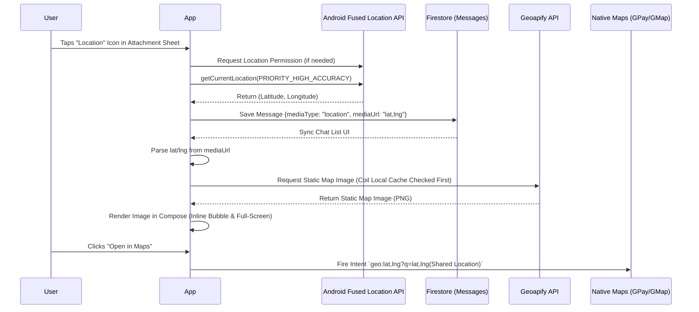

# Location Sharing Implementation

This document explains the architecture and logic behind the Location Sharing feature in RippleChat, specifically focusing on generating visual map snippets using the Geoapify Static Maps API and implementing efficient caching.

## Architecture & End-to-End Flow

## Logic Explained

### 1. Extracting Location (No GPS fallback)
We utilize `FusedLocationProviderClient`. Instead of fetching `lastLocation` (which might be null or stale), we use `getCurrentLocation()`. If it returns null, we show an `AlertDialog` prompting the user to open Android Settings and turn on GPS hardware.

### 2. Rendering Maps (Geoapify Static Maps)
We migrated from manually calculating Spherical Mercator CartoDB tiles to using the highly detailed and professional **Geoapify Static Maps API**. 
- It provides a crisp map image natively supporting red markers and modern styles (`osm-bright-smooth`).
- We use this API for both the inline chat bubble map and the expanded `FullScreenLocationViewer`.

### 3. Interactive Maps
For real navigation, we don't embed heavy map SDKs. We construct a URI: `geo:{lat},{lng}?q={lat},{lng}` and fire an `ACTION_VIEW` intent. Android automatically offers to open this inside the user's installed Google Maps app.

---

## Caching Strategy for Location Maps

### Current Implementation (Coil Local Cache)
Currently, the application relies on Coil's built-in caching.
- **API Used:** Geoapify Static Maps API.
- **Network Impact:** The first time a user views a specific coordinate map, `Coil` makes 1 API hit to Geoapify. Subsequent views of the exact same coordinate by the same user do not hit the API, as the image is served from the device's local disk cache.

### Future Optimization (Cloudinary Pre-fetching)
As the app scales (especially for group chats with many users), we want to avoid multiple users triggering multiple separate API hits when viewing the same shared location map.

**Proposed Flow for Ultimate API Efficiency:**
1. **User sends a location:** The user selects a location and clicks "Send".
2. **Backend/ViewModel Interception:** The `ChatViewModel` makes a background request to the Geoapify API to fetch the static map image.
3. **Cloudinary Upload:** The downloaded map image is uploaded directly to **Cloudinary**.
4. **Firestore Storage:** The returned Cloudinary URL is saved in Firestore as the `mediaUrl` for the `location` message (instead of just the raw `lat,lng` string).
5. **Client Rendering:** All receivers of the message simply load the image from Cloudinary using `Coil`.
**Result:** Exactly **1 API hit to Geoapify per shared location globally**, regardless of group size or application re-installs.
