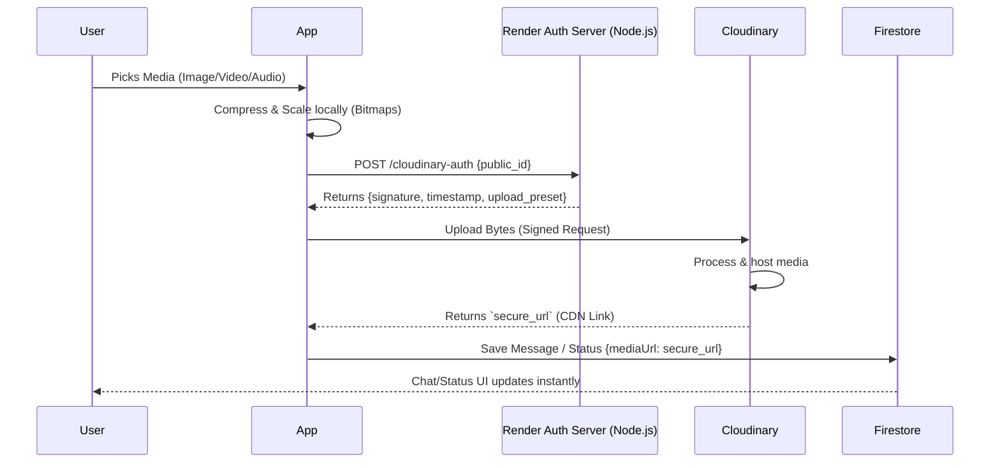

# Media Upload Infrastructure

This document describes the end-to-end flow for uploading rich media (Images, Videos, and Audio) in RippleChat, utilizing Cloudinary for high-performance transformations and Firebase Storage as an alternative.

## Architecture & End-to-End Flow



## Logic Explained

### 1. Local Pre-processing
Before uploading, the Android client uses Kotlin Coroutines on `Dispatchers.Default` to compress media. For images, we scale bitmaps down to a maximum dimension of 1024px and compress to JPEG format to save massive amounts of bandwidth. Audio is recorded using Android's built-in `MediaRecorder` in AAC/M4A format.

### 2. Security (Signed Uploads)
We do not hardcode Cloudinary API keys into the Android App, as APKs can be decompiled. Instead, we use an Authentication Server:
* The Android app requests a cryptographic "Signature" from the backend (hosted on Render).
* The backend signs the payload using the secret key and returns the signature.
* The Android app uploads the raw bytes + the signature directly to Cloudinary. Cloudinary verifies the signature and accepts the file.

### 3. Media Abstraction
In our Data layer, all media is stored uniformly regardless of its file type:
```kotlin
data class ChatMessage(
    val isMedia: Boolean = true,
    val mediaType: String = "video", // Can be image, video, audio, location
    val mediaUrl: String = "https://res.cloudinary.com/..."
)
```
The Compose UI layer uses `AsyncImage` for images, ExoPlayer for videos, and Android `MediaPlayer` for audio, cleanly routing rendering logic based entirely on the `mediaType` flag.
