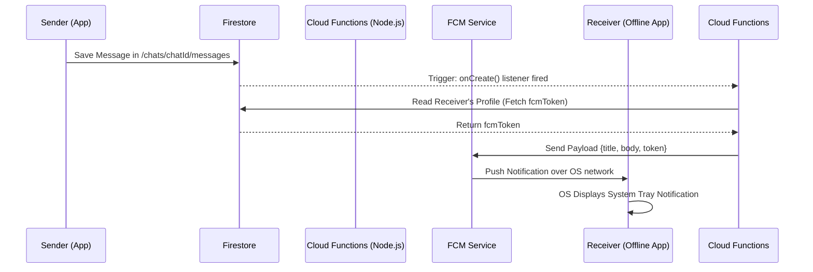

# Push Notifications & Offline Support

This document outlines the architecture for delivering push notifications to offline users via Firebase Cloud Messaging (FCM) when they are not actively using RippleChat.

## Architecture & End-to-End Flow

## Logic Explained

### 1. FCM Token Registration
When a user logs into RippleChat, the app asks Firebase for a unique FCM Registration Token. This token acts as a routing address for that specific device. The app saves this `fcmToken` into the user's document in the `users` Firestore collection.

### 2. Node.js Backend Trigger
RippleChat utilizes a backend Node.js server (Firebase Cloud Functions / Render server). It listens for new documents being inserted into the database (e.g., when a user sends a message). 

### 3. The Delivery Mechanism
When User A sends a message to User B:
1. The backend detects the new message.
2. It fetches User B's profile from Firestore to get their `fcmToken`.
3. It constructs a notification payload containing User A's name and the message text.
4. It issues an HTTP POST request to the Firebase Admin SDK / FCM API.
5. Google's FCM servers deliver the push notification directly to the Android OS of User B, which wakes up the app's `FirebaseMessagingService` receiver and displays a banner notification, even if the app was killed.
