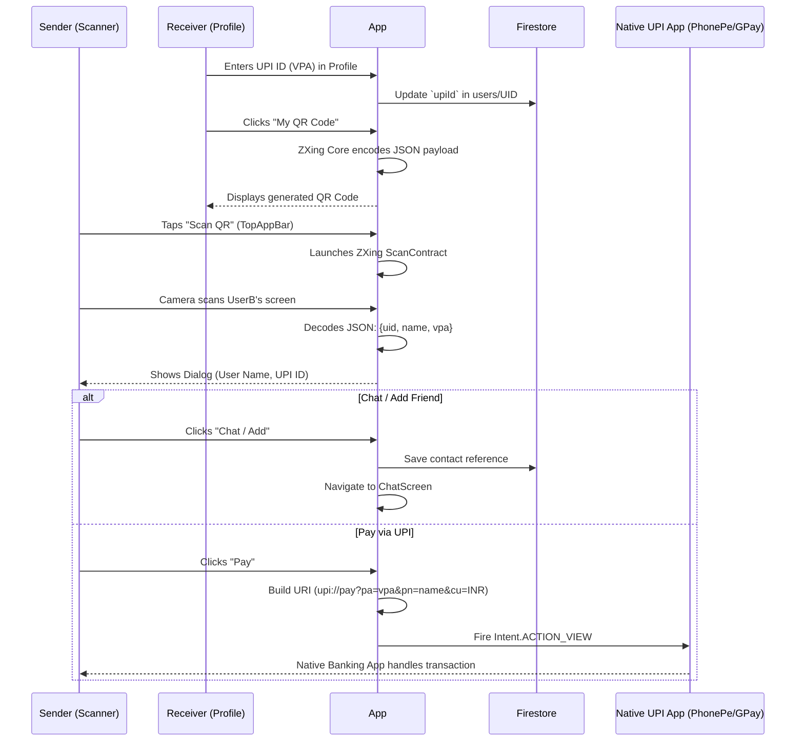

# UPI Payments & QR Scanner Implementation

This document outlines the architecture for the "Super App" feature set: QR Code generation, Scanning, and native UPI intent invocation for peer-to-peer payments.

## Architecture & End-to-End Flow



## Logic Explained

### 1. Data Model Update
The core `User` model inside `ProfileVM` now contains a `upiId: String?` property. A new UI field is added to `ProfileScreen.kt` allowing users to declare their financial handle.

### 2. QR Code Generation (ZXing Core)
When a user clicks "My QR Code", we format a lightweight JSON payload:
```json
{
  "uid": "user_id_123",
  "name": "Ankit",
  "vpa": "ankit@okhdfcbank"
}
```
We use `QRCodeWriter()` from the `com.google.zxing:core` library to convert this JSON string into a 512x512 Bitmap Matrix, mapping `true` to Black pixels and `false` to White pixels.

### 3. QR Code Scanning (ZXing Embedded)
To avoid the immense boilerplate of CameraX and ML Kit, we implemented `com.journeyapps:zxing-android-embedded`. By using Jetpack Compose's `rememberLauncherForActivityResult(ScanContract())`, we launch an out-of-the-box scanner Activity. 
When the result is returned, we parse the JSON.

### 4. Intent Hand-off for Payments
Security is critical in FinTech. We **do not** handle bank transactions directly. Instead, we act as a bridge. If the user clicks "Pay", we construct a deep link using the standard UPI protocol scheme:
`upi://pay?pa=ankit@okhdfcbank&pn=Ankit&cu=INR`
Launching this URI triggers Android's intent resolver, prompting the user to open Google Pay, PhonePe, or Paytm to complete the secure PIN entry.
